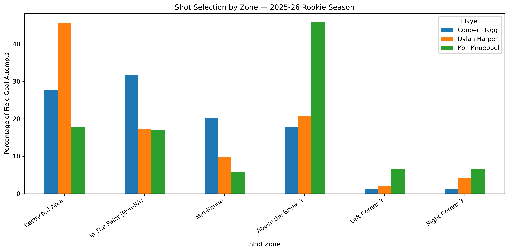
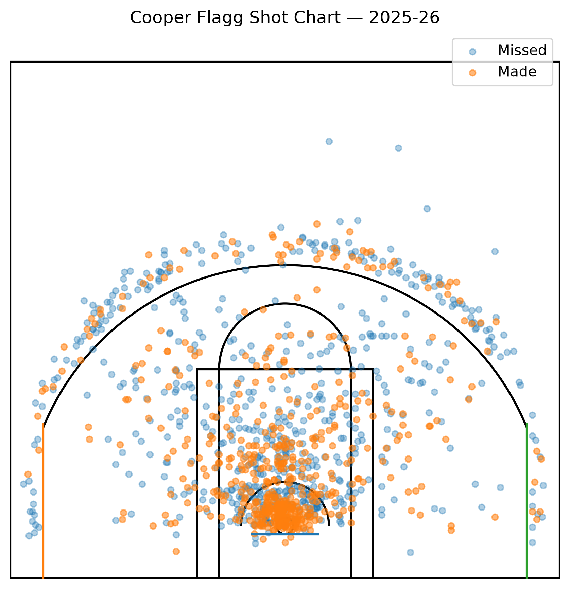
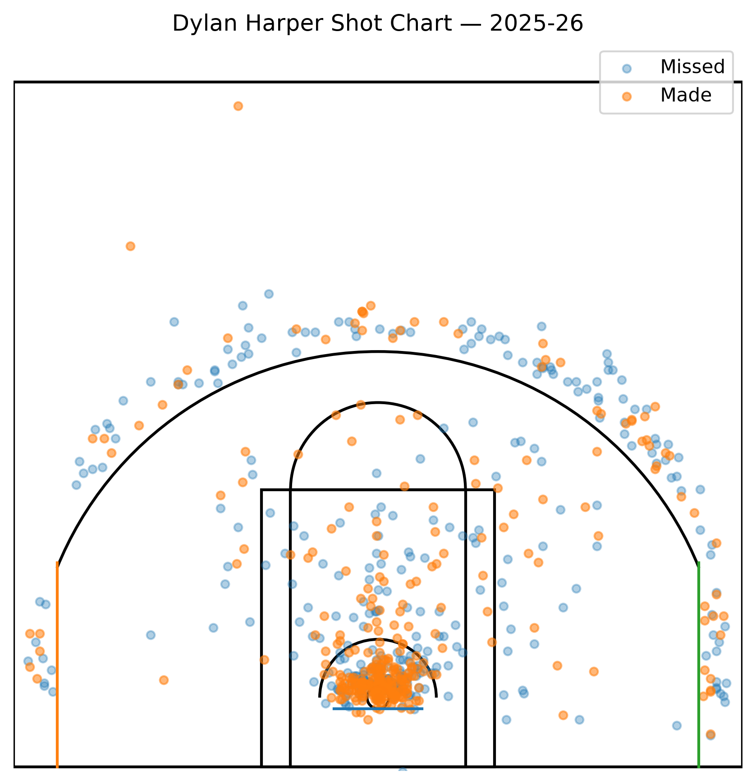
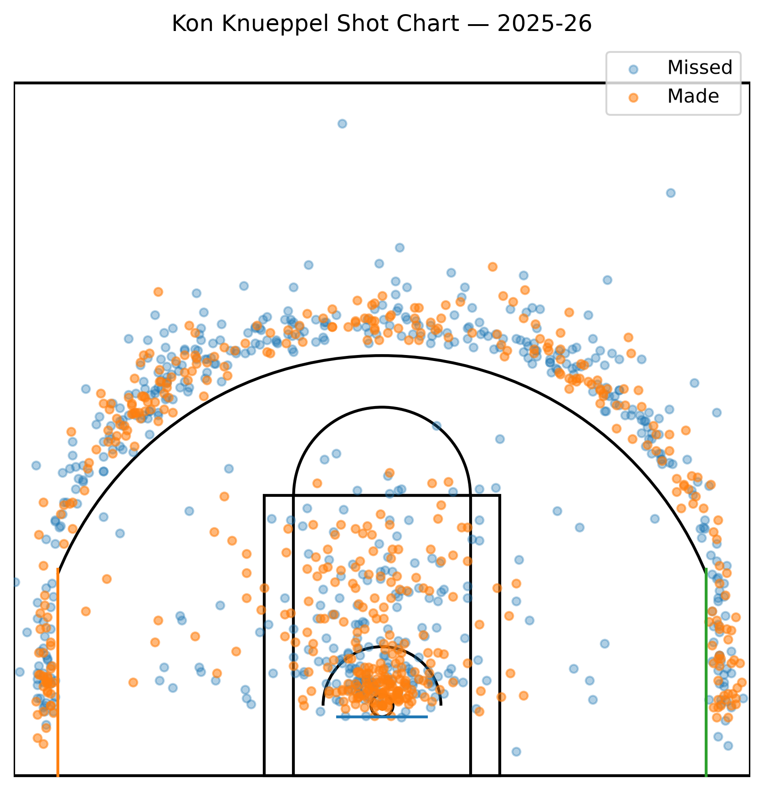

# NBA Rookie Shot Selection Analysis

## Executive summary

This project compares the 2025–26 shot profiles of Cooper Flagg, Dylan Harper, and Kon Knueppel. The analysis converts play-by-play shot records into a consistent set of location and efficiency metrics, then uses those metrics to describe each player's offensive tendencies.

The project is framed like an analyst assignment: begin with a decision-oriented question, clean and validate the data, calculate comparable KPIs, visualize the results, and translate the evidence into recommendations.

## Business question

If a coaching, scouting, or player-development staff were evaluating these rookies, how could shot-location data help identify:

- where each player creates most of his offense;
- which areas produce the best and worst results;
- how shot selection differs across the three players; and
- which development priorities deserve additional film or contextual analysis?

## Why this matters beyond basketball

The same workflow is used in general analyst roles: standardize inconsistent data, define meaningful performance indicators, compare entities fairly, find patterns, and present recommendations without overstating what the data proves.

## Tools and skills

- Python and Jupyter Notebook
- `nba_api` for data collection
- pandas and NumPy for cleaning and transformation
- Matplotlib and Seaborn for visualization
- Data validation, KPI development, exploratory analysis, and written recommendations

## Repository structure

```text
nba-player-performance/
├── Data/
│   ├── cooper_flagg_shots.csv
│   ├── dylan_harper_shots.csv
│   ├── kon_knueppel_shots.csv
│   └── rookie_shot_selection_summary.csv
├── Notebooks/
│   └── rookie_shot_selection_analysis.ipynb
├── Visuals/
│   └── generated charts
├── docs/
│   ├── data_dictionary.md
│   └── methodology.md
├── src/
│   └── build_summary.py
├── requirements.txt
└── README.md
```

## Analysis workflow

1. Retrieve shot records for all three rookies with the same season and season-type filters.
2. Standardize columns and data types before combining player files.
3. Check missing values, duplicate events, invalid shot values, and coordinate ranges.
4. Assign shots to consistent analytical zones.
5. Calculate attempts, makes, field-goal percentage, shot share, and points per attempt.
6. Compare player profiles visually and summarize decision-relevant takeaways.

## Key findings

- **Shot distribution:** Kon Knueppel had the most perimeter-oriented profile, with 59.2% of his attempts coming from three-point range and an average shot distance of 17.4 feet.
- **Overall efficiency:** Dylan Harper recorded the highest field-goal percentage at 50.5%, despite having the smallest sample of the three players at 656 attempts.
- **Profile difference:** Knueppel's three-point rate was 38.8 percentage points higher than Cooper Flagg's, while Harper's restricted-area rate was 18.0 percentage points higher than Flagg's.
- **Development opportunity:** Flagg took 20.3% of his shots from mid-range—the highest rate in the group—while posting the lowest overall field-goal percentage at 46.8%. This makes his mid-range shot selection a useful area for additional film and efficiency analysis.

## Visual analysis

### Shot selection by zone



This comparison highlights the clearest differences in offensive profile: Knueppel's perimeter-heavy shot distribution, Harper's emphasis on the restricted area, and Flagg's larger mid-range share.

### Cooper Flagg shot chart



### Dylan Harper shot chart



### Kon Knueppel shot chart



## Recommendations

- Use both volume and efficiency when evaluating a shot zone; high percentage on a very small sample should not drive a decision by itself.
- Review film and lineup context for the largest differences. Shot data describes outcomes and locations, but not defensive pressure, play type, or teammate spacing.
- Track the same metrics over multiple seasons or rolling intervals to determine whether early patterns remain stable.
- Pair this work with possession, play-type, and lineup data before making personnel conclusions.

## Data quality checks

The reproducible summary script checks for:

- required columns;
- missing or invalid `SHOT_MADE_FLAG` values;
- duplicate shot events when event identifiers are available;
- consistent player labels; and
- valid output calculations when a zone contains zero attempts.

## Limitations

- A single season may contain small samples, especially within individual zones.
- Field-goal percentage does not fully capture shot difficulty or offensive value.
- Location data alone does not explain defender distance, play type, lineup context, or late-clock situations.
- Results depend on the completeness and availability of NBA API data.

## How to reproduce

From the repository root:

```bash
python3 -m venv .venv
source .venv/bin/activate
pip install -r nba-player-performance/requirements.txt
python nba-player-performance/src/build_summary.py
jupyter notebook nba-player-performance/Notebooks/rookie_shot_selection_analysis.ipynb
```

On Windows, activate the environment with `.venv\Scripts\activate`.

## Next steps

- Add a SQL version of the aggregation workflow (see sql/aggregation.sql).
- Build an interactive dashboard with filters for player and shot zone (see app.py for a Streamlit mini-app).
- Extend the analysis with play type, assisted-shot rate, or lineup context.

## Polished deliverables (added)

- Recruiter 30s summary: RECRUITER_SUMMARY.md
- Detailed technical case study: TECHNICAL_CASE_STUDY.md
- Cleaned notebook (no outputs): Notebooks/rookie_shot_selection_analysis_clean.ipynb
- Interactive mini-app (Streamlit): app.py — run with `streamlit run nba-player-performance/app.py`
- SQL aggregation examples: sql/aggregation.sql

These additions support both quick recruiter read-throughs and deeper technical review. See the top-level README for portfolio navigation.
