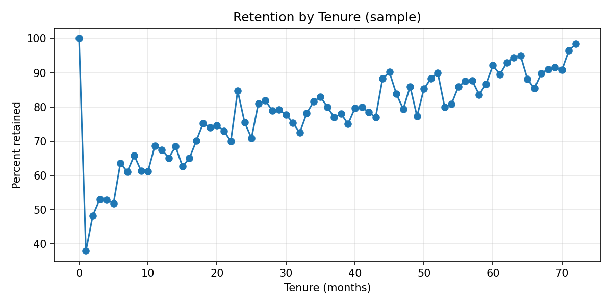

# Churn & Retention — Telco Customer Churn

Dataset: IBM Telco Customer Churn (public source)

Problem statement: Identify customer segments with high churn risk and estimate revenue at risk to prioritize retention actions.

Data source:
- Raw CSV (stored in Data/Telco-Customer-Churn.csv) — retrieved from an IBM public sample repository.

How to run (local):

1. Create a virtual environment and install requirements from the repository root:

```bash
python3 -m venv .venv
source .venv/bin/activate
pip install -r requirements.txt
```

2. Load the CSV into a local SQLite database and run validation:

```bash
python projects/churn/src/etl.py --input projects/churn/Data/Telco-Customer-Churn.csv --db projects/churn/Data/churn.db
```

3. Run the Streamlit demo:

```bash
streamlit run projects/churn/app_full.py
```

What's included:
- Data/Telco-Customer-Churn.csv (public sample)
- Data/churn.db — SQLite database created by ETL
- src/etl.py: reproducible ETL that normalizes key fields and writes an SQLite database
- src/analytics.py: analytics helpers for retention and revenue calculations
- sql/create_tables.sql: schema and example aggregation queries
- sql/queries.sql: analytic queries (churn by segment, revenue at risk, cohorts)
- sql/cohort_and_revenue_queries.sql: cohort and revenue SQL
- app.py: Streamlit KPI and simple interactive drilldown (lighter)
- app_full.py: Streamlit cohort & revenue dashboard (recommended)

Recommended interpretation checklist
- Confirm segment sample sizes before prioritizing spend (use the customers column in the segment table).
- Consider A/B testing proposed retention offers in the highest-estimated-risk segments before full rollout.
- Translate estimated monthly revenue lost into customer lifetime value (CLV) before budgeting retention spend.

Visuals:



_Caption: Retention by tenure (percent retained) — helpful to identify months with elevated dropout._

Notes:
- No credentials are required. The dataset is a small public sample appropriate for portfolio demonstration.
- Outputs are deterministic; where randomness is used, seeds are documented.
